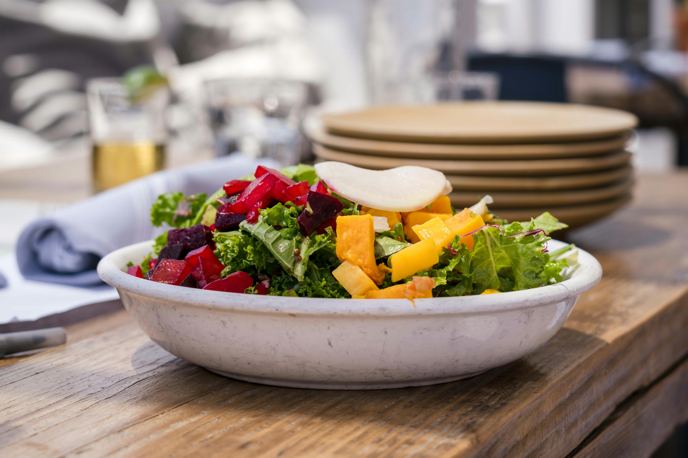
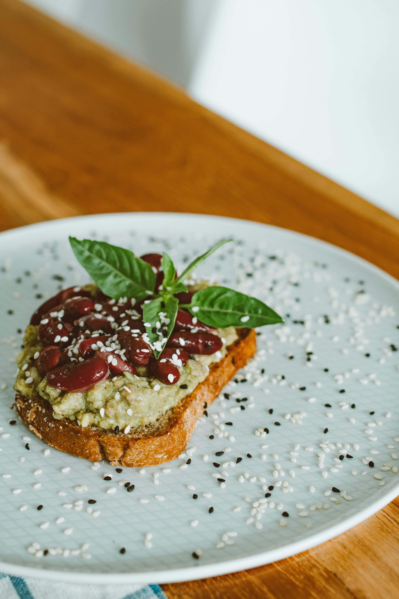
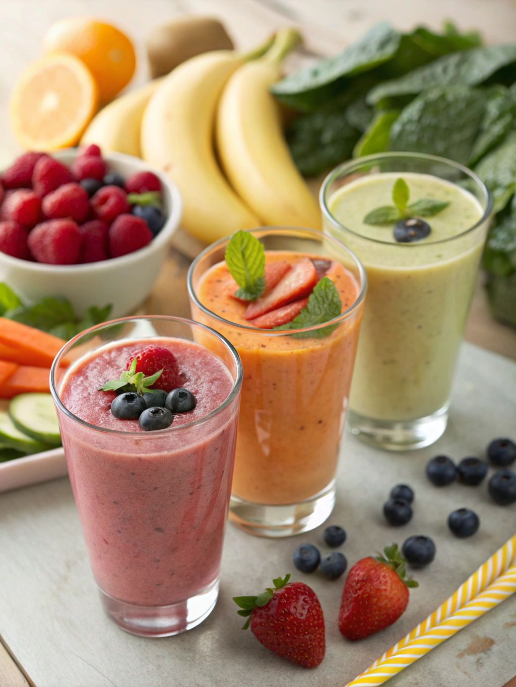
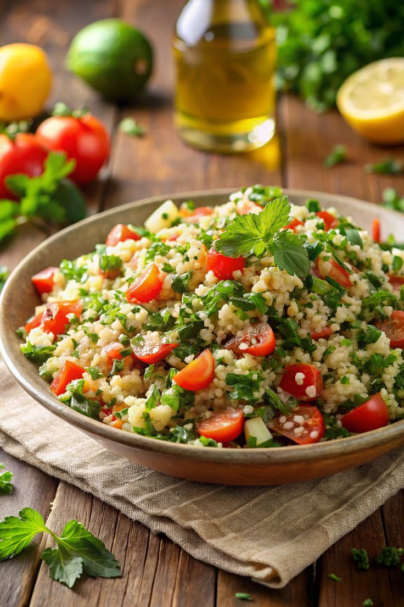
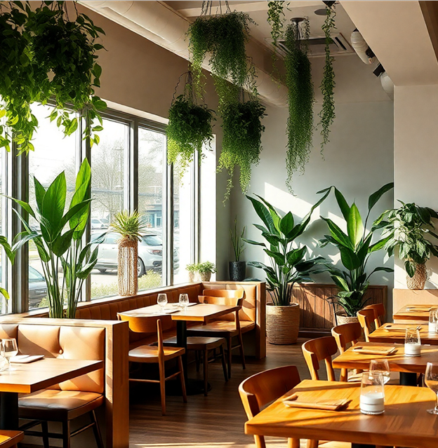

# final

[Figma-reference-link](https://www.figma.com/design/JubAVc7DS628DJ9pzeKcTk/Web-dev-final?node-id=0-1&t=ndIG9nw7i5Ypn3A3-1)

[Font Awesome](https://kit.fontawesome.com/b24d73bea6.js)
[Bootstrap](https://cdn.jsdelivr.net/npm/bootstrap@5.3.3/dist/css/bootstrap.min.css)
[Animate.css](https://cdnjs.cloudflare.com/ajax/libs/animate.css/4.1.1/animate.min.css)

[Font](https://fonts.googleapis.com/css2?family=Merriweather+Sans:ital,wght@0,300..800;1,300..800&display=swap)

[images](https://www.pexels.com/)

[generated_images](https://chatgpt.com/)

