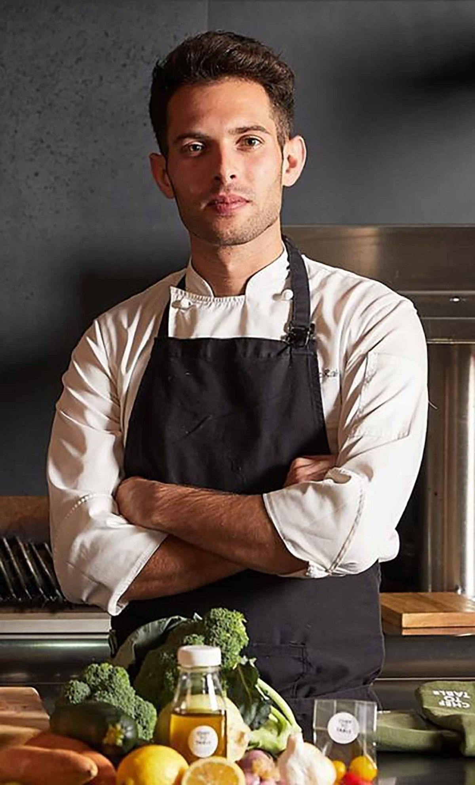
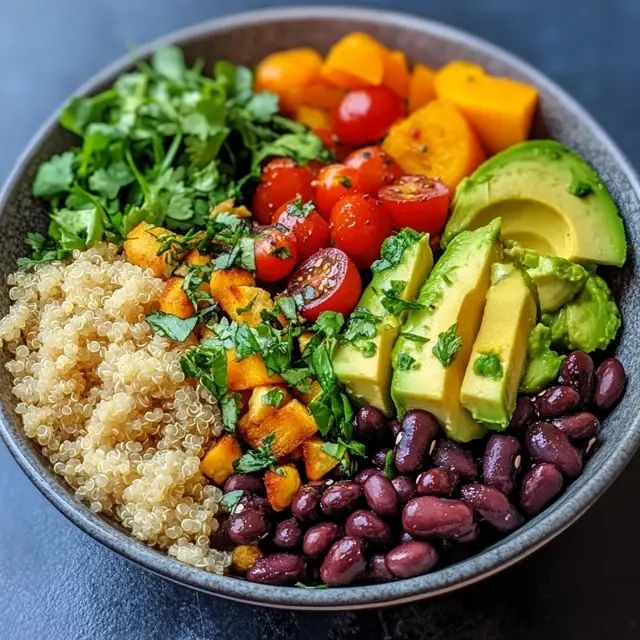

# Final

## Figma Reference Link
[Green Leaf Site Mockup Design](https://www.figma.com/design/JubAVc7DS628DJ9pzeKcTk/Web-dev-final?node-id=0-1&t=ndIG9nw7i5Ypn3A3-1)

## Frame Work and Library
[Font Awesome](https://kit.fontawesome.com/b24d73bea6.js)
[Bootstrap](https://cdn.jsdelivr.net/npm/bootstrap@5.3.3/dist/css/bootstrap.min.css)
[Animate.css](https://cdnjs.cloudflare.com/ajax/libs/animate.css/4.1.1/animate.min.css)

## Fonts used for the site
[Font](https://fonts.googleapis.com/css2?family=Merriweather+Sans:ital,wght@0,300..800;1,300..800&display=swap)

## Map link used for contact service page
[Map](https://www.google.com/maps/embed?pb=!1m18!1m12!1m3!1d1402.010907695859!2d-75.7593478931932!3d45.34837189273793!2m3!1f0!2f0!3f0!3m2!1i1024!2i768!4f13.1!3m3!1m2!1s0x4cce0718cc4a6ad7%3A0xc6cc467725843e2b!2sAlgonquin%20College%20-%20Ottawa%20Campus!5e0!3m2!1sen!2sca!4v1753978956437!5m2!1sen!2sca)

## Image sources
[Pexels](https://www.pexels.com/)

[generated_images](https://chatgpt.com/)

## Images used for the site

